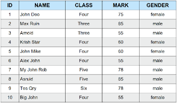
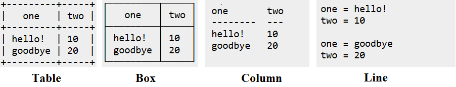
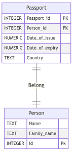
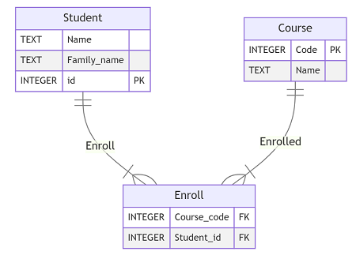
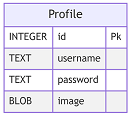
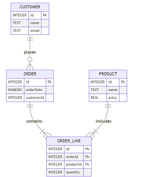

## Objectives :
- Introduction To Database and Database Management Systems
- Working With SQLite
- Working With Entity Relationship Diagram
## Database And Database Management Systems :
### Introduction :
We live in the **data era**. Data is everywhere around us we work with it, store it, send it, and receive it. But what exactly does "data" represent ?  
The term **data** refers to facts, statistics, information, and quantities that can be stored and transmitted in the form of electrical signals. Examples of data include messages we send and receive from friends, pictures we store on our computers or post on social media, and even our usernames and passwords for websites.
### How Data is Stored:
There are **different ways to store data**, depending on how it is used. When it comes to data that we use and generate while working with software, it is often stored in **RAM (Random Access Memory)**. This type of memory is temporary and gets deleted once the computer is turned off or the software is closed.  
For **text**, data can be stored in **text files**, while **images and videos** are typically stored as **binary files**. But what about other types of data, such as the information websites use to store your **username and password**, or the data apps use to save your **records**? This kind of data is stored in specialized systems called **databases**.  
### Database :
Databases are designed to efficiently organize, manage, and retrieve large amounts of structured or unstructured data. They provide a secure and scalable way to store information, making them essential for applications like websites, mobile apps, and enterprise systems.  
There are two main types of databases:
#### Relational Database :
Relational or SQL databases store data in **structured tables** consisting of rows and columns. They use **SQL (Structured Query Language)** to manage and query data. Relationships between tables are established using **keys**.
Each table can have a **primary key**, which uniquely identifies each record in the table. This primary key can be referenced from another table using a **foreign key**, creating a relationship between the two tables.
  

#### SQL :
SQL stands for Structured Query Language. It is a language used to interact with databases, via which you can create, read, update, and delete data in a database
#### Non Relational Databse :
Non Relational or NoSQL databases store data in flexible formats such as key-value pairs, documents, graphs, or wide-column stores. They are ideal for handling unstructured or semi-structured data and are highly scalable.
```
'[
{"name":"Ali", "age":20, "car":null},
{"name":"John", "age":30, "car":null}
]'
```
### Database Management Systems :
When working with databases, we need specialized systems to manage and control them. This is where **Database Management Systems (DBMS)** come into play. A DBMS is a software application that enables users to create, manage, delete, and modify data within a database. Without a **DBMS**, a database would be inefficient and essentially useless.  
Examples of **DBMS** include:  
- For **relational databases**: MySQL, PostgreSQL, SQLite
- For **non-relational databases**: MongoDB
## SQLite :
### Introduction :
SQLite is a lightweight and efficient database management system, ideal for creating small applications, projects, and managing simple, small-scale databases. It is easy to install and seamlessly integrates with various programming languages, making it an excellent choice for beginners who want to start learning or working with databases and database management systems. Its simplicity and minimal setup requirements make SQLite one of the best tools for beginners to dive into the world of databases.  
Installation Guide [Here](https://www.tutorialspoint.com/sqlite/sqlite_installation.htm)
### SQLite Commands :
After installing SQLite, the first thing we need to do is to create or open a database file. To do this, we use the command `sqlite3` followed by the name of the database. If the database exists, it will open it; if it doesn't exist, SQLite will create and open it.  
After opening the database, you will enter the SQLite **Command Line Interface (CLI)**. The SQLite CLI comes with a variety of commands to manage the database. Here are some of the most commonly used commands:
- `.tables`: Displays a list of all tables inside the database.
- `.schema`: Displays the schema of all tables in the database. You can use `.schema table_name` to display the schema of a specific table.
- `.open database_name`: Closes the current database and opens a new one.
- `.mode display_mode`: Changes the display mode of the data. Available modes include:
    - **table**: Displays data in a table format.
    - **box**: Displays data in a box format (a special table format).
    - **line**: Displays data as a lines with each line represent column .
    - **column**: Displays data in column format, but without separators between columns or lines.      
  
- `.header on/off`: Toggles the display of table headers on or off.
- `.load file_name`: Loads data from an external file into the database.
- `.output file_name`: Sets the output file where data retrieved from the database will be stored.
- `.read file_name`: Reads and executes SQL queries from a file.
- `.quit`: Closes the database file, exits the SQLite CLI, and saves all changes made.
- ``.help`` Display all SQLite commands 
### Data Types :
Before creating a database, it’s important to determine the type of data we want to store in each column. In SQLite, we can use the following **data types** :
- **TEXT**: Used for storing text data, such as strings or characters. Example: `"Hello"`, `'SQLite'`.
- **NUMERIC**: Used for storing numeric data, which can include both integers and floating-point numbers. Example: `42`, `3.14`.
- **INTEGER**: Used for storing whole numbers (positive or negative). Example: `100`, `-5`.
- **REAL**: Used for storing floating-point numbers (decimals). Example: `2.5`, `-0.001`.
- **BLOB**: Used for storing binary data, such as images or files. Example: `x'53514C697465'` (hexadecimal format).
## Entity Relationship Diagram :
### Introduction :
An **ER Diagram** (Entity-Relationship Diagram) is a visual representation of the structure of a database. It illustrates the relationships between entities (tables) and their attributes (columns) in a clear and organized way
### Components of an ER Diagram:

#### Entity:

An **Entity** in an ERD (Entity-Relationship Diagram) represents a definable thing or concept within a system, such as a person, object (e.g., `Invoice`), concept, or event. When identifying entities, think of them as **nouns**. In ER models, an entity is represented as a **rounded rectangle**, with its name at the top and its attributes listed inside the shape.  
**Note:** In ERD, the term **"entity"** is often used interchangeably with **"table"**, but they refer to the same concept.
#### Entity Attributes:

**Attributes** (also known as columns) are **properties or characteristics** of an entity. Each attribute has:
- A **name** that describes the property.
- A **type** that defines the kind of data it stores (e.g., `INTEGER`, `TEXT`).
When creating an ERD for physical database development, it’s important to use data types supported by the target RDBMS.
#### Primary Key:
A **Primary Key (PK)** is a special attribute that **uniquely identifies each record** in a database table. In other words, no two records can have the same value for the primary key attribute. 
#### Foreign Key:

A **Foreign Key (FK)** is a **reference to a primary key** in another table. It establishes relationships between entities. Unlike primary keys, foreign keys do not need to be unique, multiple records can share the same foreign key value.
### Relationships Between Entities :
A **relationship** between two entities indicates that they are **associated with each other** in some way. For example, a `Student` might enroll in a `Course`. In this case, the `Student` entity is related to the `Course` entity, and this relationship is represented as a **connector** between them in an ER diagram.
#### Cardinality :
**Cardinality** defines the number of occurrences in one entity that are associated with the number of occurrences in another entity. For example, **ONE team** can have **MANY players**. In an ER diagram, the `Team` and `Player` entities are connected with a **one-to-many relationship**.  
Cardinality is represented in ER diagrams using **crow's foot notation** at the ends of connectors. The three most common types of cardinal relationships are:
1. **One-to-One (1:1)**
2. **One-to-Many (1:N )**
3. **Many-to-Many (M:N )**
##### 1. One-to-One Cardinality :
A **one-to-one relationship** is used when an entity is split into two parts to make the information more concise and easier to understand.  
**For example:**
A `Person` entity might be split into `Person` and `Passport`, where each person has exactly one passport, and each passport belongs to only one person.  

##### 2. One-to-Many Cardinality :
A **one-to-many relationship** describes a relationship between two entities, `X` and `Y`, where:
- One instance of `X` can be linked to **many** instances of `Y`.
- However, each instance of `Y` is linked to **only** one instance of `X`.
**For example:**
A ``Department`` can have **many** `Employees`, but each `Employee` belongs to only **one** `Department`.  
  
##### 3. Many-to-Many Cardinality :
A **many-to-many relationship** describes a relationship between two entities, `X` and `Y`, where:
- One instance of `X` can be linked to **many instances of `Y`**.
- Similarly, one instance of `Y` can be linked to **many instances of `X`**.
**For example:**
A `Student` can enroll in **many** `Courses`, and a `Course` can have **many** `Students`.
**Note:** In a physical ERD, a many-to-many relationship is resolved by introducing a **junction table** (or associative entity), which splits the relationship into **two one-to-many relationships**.  

  
### Mermaid :
Mermaid is one of many tools that can be used to create Entity Relationship Diagrams (ERDs). It features an easy and simple syntax, making it accessible for both beginners and experienced users. Mermaid can be used online through its [web-based editor](https://mermaid.live/edit) or integrated as an extension in Visual Studio Code, providing flexibility for developers and designers. 
#### Example:
Let’s suppose we want to design a database to store information about students and the courses they are taking. We will need the following:
1. **Student Entity**: This entity will have attributes such as `student_name`, `family_name`, and `student_id`.
2. **Course Entity**: This entity will have attributes such as `course_name` and `course_code`.
Next, we need to establish a relationship between the `Student` and `Course` entities. We know that a student can enroll in more than one course, and a course can have more than one student. Therefore, the relationship between them is **many-to-many**.   
To establish a many-to-many relationship, we need to create a separate entity to represent this relationship. We can call this entity `Enroll`. It will have two attributes: `student_id` and `course_code`, both of which are foreign keys referencing the `Student` and `Course` entities, respectively.  
we represent that in the Mermaid editor as following

```
erDiagram
Student {
        TEXT Name
        TEXT Family_name
        INTEGER id PK
}
Course {
        INTEGER Code PK
        TEXT Name
}
Enroll {
        INTEGER Course_code FK
        INTEGER Student_id FK
}
Student ||--|{ Enroll : Enroll    

Course ||--|{ Enroll : Enrolled
```

#### Explain :
The first line, `erDiagram`, tells the editor that we are creating an Entity-Relationship Diagram (ERD). After this line, we define our entities. Each entity starts with its name, followed by `{}`. Inside the curly braces, we list the attributes, with each attribute on a new line. The syntax for an attribute is as follows:
1. Start with the **data type** of the value.
2. Follow it with the **name of the attribute**.
3. Finally, specify the **type of the attribute** (e.g., `PK` for primary key or `FK` for foreign key).
Once the entities are defined, we establish relationships between them. This is done by writing the name of the first entity, followed by the type of relationship, and then the name of the second entity. The relationship types are represented as follows:
- `||--||` for a **one-to-one** relationship.
- `||--|{` for a **one-to-many** relationship
## Task:
Write Mermaid script to create the following Entity Relationship Diagrams (ERD)  
### Diagram 1:
  
### Diagram 2:
  
