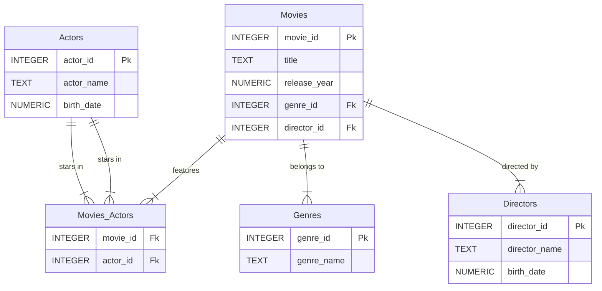
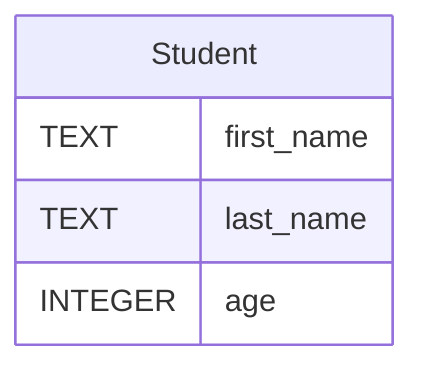
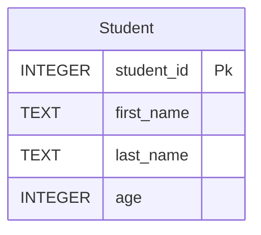
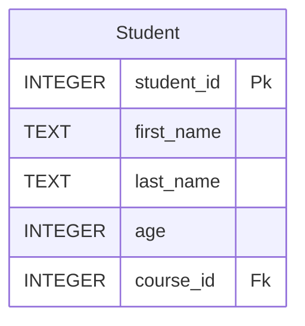
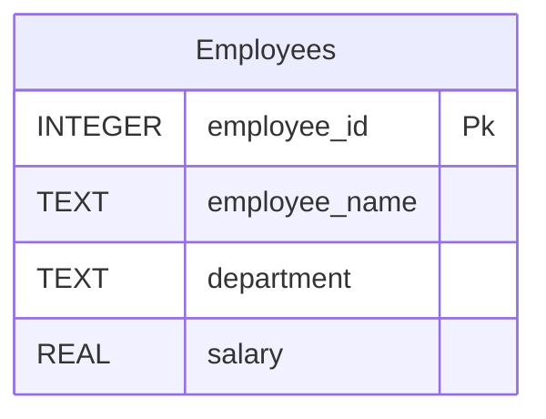

## Objectives :
- Designing Database and Creating Tables
- Creating  Constraint in our Tables
- Deleting Tables and Updating Tables Schema
## Designing Databases and Creating Tables:
### SQL Language:
**SQL (Structured Query Language)** is programming language designed for managing and manipulating relational databases. It allows users to perform operations such as inserting, updating, deleting, and querying data, as well as creating and modifying database structures.  
SQL comes in many versions, each tailored to specific **Database Management Systems (DBMS)** like MySQL, PostgreSQL, Oracle, SQL Server, and SQLite. While the syntax of SQL is generally consistent across these systems, there are some variations and extensions unique to each DBMS. 
#### Key SQL Operations:
1. **Creating Data**: Use the `INSERT` statement to add new records to a table.
2. **Reading Data**: Use the `SELECT` statement to retrieve data from one or more tables.
3. **Updating Data**: Use the `UPDATE` statement to modify existing records in a table.
4. **Deleting Data**: Use the `DELETE` statement to remove records from a table.
5. **Creating Tables**: Use the `CREATE TABLE` statement to define a new table structure.
### Designing Databases:
**Designing a database and its tables** is one of the most critical steps in creating a robust and efficient database. It involves identifying the **entities** (or tables) that will represent the data, defining the **relationships** between these entities, and determining the **columns** (attributes) each entity will have, along with the appropriate **data types** for storing the data.  
To design a database effectively, you need to:
1. **Identify Entities**: Determine the key objects or concepts that need to be stored in the database (e.g., users, products, orders).
2. **Define Relationships**: Establish how these entities are related to one another (e.g., one-to-one, one-to-many, many-to-many).
3. **Specify Columns and Data Types**: Define the attributes for each entity and choose the correct data types (e.g., `INTEGER`, `TEXT`, `DATE`) to store the data efficiently.
This design process is visualized and done by using an **Entity-Relationship Diagram (ERD)**, which provides a clear and structured representation of the database schema.
#### Example:
Lets suppose we want to create a database to store details about **movies**, their **types (genres)**, the **actors** who starred in those movies, and the **directors** who directed them.   
The first step in designing a database is to **identify the entities**, define their **attributes**, and establish **relationships** between those entities.  
1. **Movies**: Represents the movies in the database.
    - Attributes:
        - `movie_id` (Primary Key): A unique identifier for each movie.
        - `title`: The name of the movie.
        - `release_year`: The year the movie was released.
        - `genre_id` (Foreign Key): Links the movie to its genre.
        - `director_id` (Foreign Key): Links the movie to its director.
2. **Genres**: Represents the types or categories of movies (e.g., Action, Comedy, Drama).
    - Attributes:
        - `genre_id` (Primary Key): A unique identifier for each genre.
        - `genre_name`: The name of the genre.
3. **Actors**: Represents the actors who starred in the movies.
    - Attributes:
        - `actor_id` (Primary Key): A unique identifier for each actor.
        - `actor_name`: The name of the actor.
        - `birth_date`: The birth date of the actor.
4. **Directors**: Represents the directors of the movies.
    - Attributes:
        - `director_id` (Primary Key): A unique identifier for each director.
        - `director_name`: The name of the director.
        - `birth_date`: The birth date of the director.
5. **Movie_Actors**: To handle the many-to-many relationship between movies and actors. This is necessary because one movie can feature multiple actors, and one actor can star in multiple movies.
    - Attributes:
        - `movie_id` (Foreign Key): Links to the `movie_id` in the Movies table.
        - `actor_id` (Foreign Key): Links to the `actor_id` in the Actors table.
The **Entity-Relationship Diagram (ERD)** for this database will look as follows:  


### Creating Database Tables:
Creating tables is accomplished using the SQL language. To create a table, you use the `CREATE TABLE` command, followed by the table name. After the table name, you specify the columns and their data types inside parentheses `()`. Each column is defined by its name followed by its data type.  
For example, to create a table named `Student`, you would write:

```
CREATE TABLE Student(
 first_name TEXT,
 last_name  TEXT ,
 age        INTEGER 
);
```
If a table has a primary key, it can be added after the column declarations by using the `PRIMARY KEY` constraint after the datatype. or we can move the `PRIMARY KEY`  constraint to the end of the table.
For example if we add student_id to the previous tables 

**Method 1:**
```

CREATE TABLE Student(
 student_id   INTEGER PRIMARY KEY, 
 first_name   TEXT,
 last_name    TEXT,
 age          INTEGER,
);
```
**Method 2:**
```
CREATE TABLE Student(
 student_id   INTEGER, 
 first_name   TEXT,
 last_name    TEXT,
 age          INTEGER,
 PRIMARY KEY(student_id)
);
```
To add a foreign key to a table, you use the `FOREIGN KEY()` constraint. Inside the parentheses, you specify the column that will act as the foreign key. After that, you use the `REFERENCES` keyword, followed by the name of the table you want to reference. Inside parentheses, you include the column name from the referenced table.  
For example we add to the student table column named course_id that reference to course student taking.

```
CREATE TABLE Student (
    student_id INTEGER PRIMARY KEY,
    first_name TEXT,
    last_name TEXT,
    age INTEGER,
    course_id INTEGER,
    FOREIGN KEY (course_id) REFERENCES Courses(course_id)
);
```
#### Example :
Lets turn this Enitty relationship diagram into SQL commands

```
CREATE TABLE Actors(
    actor_id INTEGER PRIMARY KEY,
    actor_name TEXT,
    birth_date NUMERIC
);
CREATE TABLE Genres(
    genre_id INTEGER PRIMARY KEY,
    genre_name TEXT
);
CREATE TABLE Directors{
    director_id INTEGER PRIMARY KEY,
    director_name TEXT,
    birth_date NUMERIC
);
CREATE TABLE Movies(
    movie_id INTEGER PRIMARY KEY,
    title TEXT,
    release_year NUMERIC,
    genre_id INTEGER,
    director_id INTEGER,
    FOREIGN KEY (genre_id) REFERENCES Genres(genre_id),
    FOREIGN KEY (director_id) REFERENCES Directors(director_id)
);
CREATE TABLE Movies_Actors(
    movie_id INTEGER,
    actor_id INTEGER,
    FOREIGN KEY (movie_id) REFERENCES Movies(movie_id),
    FOREIGN KEY (actor_id) REFERENCES Actors(actor_id)
);
```
## Working with constraints :
### Introduction:
SQLite allows us to add more control over the values stored in a column by using constraints. We’ve already seen the `PRIMARY KEY` and `FOREIGN KEY` constraints, but SQLite offers several other constraints to work with. These constraints help ensure data integrity and enforce specific rules on the data stored in the database.
### NOT NULL:
The `NOT NULL` constraint ensures that a column cannot contain `NULL` values. If a user tries to insert or update a row without providing a value for this column, SQLite will raise an error.
#### Example:
```
CREATE TABLE Users (
    user_id INTEGER PRIMARY KEY,
    username TEXT NOT NULL
);
```
### UNIQUE:
The `UNIQUE` constraint ensures that all values in a column are unique across all rows in the table. This means no two rows can have the same value in this column.
#### Example:
```
CREATE TABLE Products (
    product_id INTEGER PRIMARY KEY,
    product_code TEXT UNIQUE
);
```
### AUTOINCREMENT:
The `AUTOINCREMENT` constraint is used with columns that hold numeric values (typically primary keys). It automatically increments the value of the column each time a new row is added to the table. The new value is set to the value of the previous row’s column + 1.
#### Example:
```
CREATE TABLE Orders (
    order_id INTEGER PRIMARY KEY AUTOINCREMENT,
    order_date TEXT
);
```
### DEFAULT:
The `DEFAULT` constraint allows you to specify a default value for a column. This is useful for optional data or when you want to set a value automatically instead of relying on user input. A common use case is setting a default timestamp for when a record is created.
#### Example:
```
CREATE TABLE Accounts (
    account_id INTEGER PRIMARY KEY,
    created_at TEXT DEFAULT CURRENT_TIMESTAMP
);
```
### CHECK:
The `CHECK` constraint is used to enforce specific conditions on the data in a column. It ensures that the data meets the specified criteria before it is inserted or updated. For example, you can use it to ensure that a value in a column is greater than a certain number.
#### Example:
```
CREATE TABLE Employees (
    employee_id INTEGER PRIMARY KEY,
    age INTEGER CHECK (age > 0)
);
```
## Deleting and Updating Tables:
### Introduction:
Sometimes, after creating a database, we realize that there are ways to improve its schema. For example, some tables may no longer be necessary and need to be removed, or some tables may require additional columns to store more data. In SQL, we can achieve these changes using the `DROP` and `ALTER` commands.
### Deleting Tables:
We can delete tables from our database using the `DROP TABLE` command. This command removes the table and all the data stored in it permanently. To use this command, we write `DROP TABLE` followed by the name of the table.
#### Example:
To drop a table named `student`, we would use the following command:
```
DROP TABLE student;
```
#### Remarks:
1. **Be Careful When Dropping Tables**:
    - The `DROP TABLE` command is irreversible. Once a table is dropped, all its data and structure are lost. Make sure to back up your data if necessary.
2. **Check for Dependencies**:
    - Before dropping a table, ensure that no other tables have relationships with it. If another table has a foreign key referencing the table you are dropping, you will encounter an error. To avoid this, you may need to drop the dependent table or remove the foreign key constraint first.
### Updating Table Schema:
We can update a table's schema and add new columns to it using the `ALTER TABLE` command. This command is versatile and allows us to modify the structure of an existing table. Specifically, it can be used to:
1. Add new columns to a table.
2. Rename a table.  
3. Rename a column in a table.  
4. Remove a column in a table. 
To use this command, we write `ALTER TABLE` followed by the name of the table we want to modify.
##### Adding a New Column:
To add a new column to a table, we use the `ADD COLUMN` clause, followed by the column name and its data type.
```
ALTER TABLE table_name
ADD COLUMN column_name data_type;
```
#### Renaming a Table:
To rename a table, we use the `RENAME TO` clause, followed by the new table name.
```
ALTER TABLE table_name
RENAME TO new_table_name;
```
#### Rename a table column:
To rename a column in a table, we use the `RENAME COLUMN` clause, followed by the current column name, and then the `TO` keyword, followed by the new column name.
```
ALTER TABLE table_name
RENAME COLUMN old_column_name TO new_column_name;
```
#### Remove a column in a table:
To remove a column from a table, we use the `ALTER TABLE` statement followed by the `DROP COLUMN` clause and the name of the column to be deleted.
```

ALTER TABLE table_name
DROP COLUMN column_name;

```
## Tasks:
### Task 1:
Design a database for a library system. This system must track books, authors, members, and loan records.  
 **Requirements:**  
- Books should have a **title, ISBN, publication year, and genre**.
- Authors should have a **name and birthdate**.
- Members should have a **member ID, name, address, and contact number**.
- Loan records should track **which member borrowed which book, along with the borrow and return dates**.
You should create an Entity-Relationship Diagram (ERD) using Mermaid and write the SQL code to create the tables.
### Task 2:
You have the following "Employees":

* Use the `ALTER TABLE` command to add a new column named `email` (TEXT) to the "Employees" table.
- Add a `UNIQUE` constraint to the `email` column to ensure that each employee has a unique email address.
 - Add a `NOT NULL` constraint to the `employee_name` column.
- Add a `CHECK` constraint to the `salary` column to ensure that salaries are always greater than or equal to 0.
- Use the `ALTER TABLE` command to rename the `department` column to `dept_name`.
- Create a test table called "TestTable", and then use the `DROP TABLE` command to remove it from your database.
            
