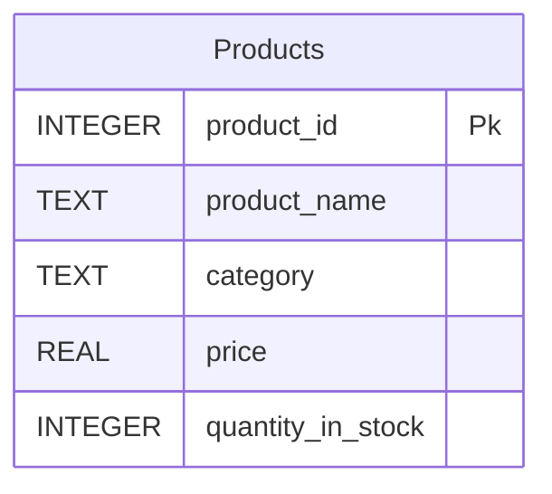

## Objectives:
- Inserting Data into Database Tables
- Querying and Selecting Data from a Database
- Updating Data in a Column and Deleting Rows from a Table
## Inserting Data Into Database:
### Introduction:
After designing the Entity-Relationship Diagram (ERD) and creating the database tables, the next step is to populate these tables with data. In SQL, this is accomplished using the `INSERT` command.
### Inserting Data:
To insert data into a database table, we use the `INSERT INTO` statement followed by the table name. Inside parentheses, we specify the columns we want to populate, and then use the `VALUES` keyword followed by the corresponding data in parentheses.  
**Syntax:**
```
INSERT INTO table_name (column1, column2, column3, ...)
VALUES (value1, value2, value3, ...);
```
#### Example :
To insert a student's ID, first name, and last name into the `student` table, the SQL statement would look like this:
```
INSERT INTO student (id, first_name, last_name)
VALUES (45791, 'Ali', 'Anunnaki');
```
### Remarks:
- Note that text or string values, such as `'Ali'` and `'Anunnaki'`, must be enclosed in single quotes (`' '`). This is how SQL distinguishes text data from numeric or other types of data.
- Numeric values, such as `45791`, do not require quotes.
### Inserting multiple rows:
We can insert more than one row into a database table at a time. To do this, we use the `INSERT INTO` statement followed by the table name and the columns we want to populate in parentheses. After specifying the columns, we use the `VALUES` keyword followed by multiple sets of parentheses, each containing the data for a single row. Each set of parentheses is separated by a comma, and the statement ends with a semicolon (`;`).
#### Example:
To insert multiple rows into the `student` table, the SQL statement would look like this:
```
INSERT INTO student (id, first_name, last_name)
VALUES 
(1, 'Ali', 'Anunnaki'),
(2, 'John', 'Doe'),
(3, 'Jane', 'Smith');
```
### Insert and Constraints
When inserting data into database tables, it is crucial to respect the constraints defined for each column. Failing to do so can result in errors. Here are some key points to consider:
1. **Unique Constraint**: If a column has a `UNIQUE` constraint, inserting duplicate values will cause an error, as the column must contain distinct values across all rows.
2. **NOT NULL Constraint**: If a column has a `NOT NULL` constraint, inserting a `NULL` value into that column will result in an error, as the column does not allow null values.
3. **Check Constraint**: If a column has a `CHECK` constraint, inserting data that does not satisfy the specified condition will cause an error.
4. **Default Value or Auto-Increment**: If a column has a `DEFAULT` value or an `AUTO_INCREMENT` constraint, inserting data into that column is optional. If no value is provided, the column will automatically use the default value or the next auto-incremented value.
### SQL Files:
Writing all SQL commands directly in the SQLite command-line interface can become cumbersome over time. It can also make it difficult to keep track of what has been created, modified, or inserted. To address this, we can create **SQL files** to store our scripts. SQL files are text files that end with the `.sql` extension and can be used to store commands for creating database schemas, inserting data, and performing other operations.
#### Running SQL Script Files:
To execute an SQL script file in SQLite, follow these steps:
1. **Open the Database**:  
    Use the `sqlite3` command followed by the name of the database file to open or create the database.
    ```sqlite3 database_name.db```
    
2. **Execute the SQL Script**:  
    Use the `.read` command followed by the name of the SQL file to execute the script.
    ```.read script_file.sql```
## Querying and Selecting Data from a Database:
### Selecting Data from cloumns:
To retrieve data from a database, we use the `SELECT` command. This command allows us to fetch either all columns from a table by using the wildcard `*`, or specific columns by listing their names after the `SELECT` keyword. After specifying the columns, we use the `FROM` keyword followed by the name of the table from which we want to retrieve the data.  
**Syntax:**
```
-- Select all columns
SELECT * FROM table_name;

-- Select specific columns
SELECT column1, column2, ... FROM table_name;
```
#### Example
- To retrieve all columns from a table named `students`, use:
	`SELECT * FROM students;`
- To retrieve only the `first_name` column from the `students` table, use:
	`SELECT first_name FROM students;`
### Sorting Data:
Sometimes, we need to do more than just retrieve data—we also need to sort it. In SQL, we can achieve this by adding the `ORDER BY` clause after specifying the columns we want to sort by.  
By default, `ORDER BY` sorts data in **ascending order** (from smallest to largest). To sort data in **descending order** (from largest to smallest), we add the `DESC` keyword after the column name.  
Additionally, we can sort data by multiple columns. In this case, the result set is first sorted by the first column specified. If two rows have the same value for the first column, they are then sorted by the second column, and so on.  
**Syntax:**
```
-- Sort by a single column (ascending by default)
SELECT column1, column2, ...
FROM table_name
ORDER BY column1;

-- Sort by a single column in descending order
SELECT column1, column2, ...
FROM table_name
ORDER BY column1 DESC;

-- Sort by multiple columns
SELECT column1, column2, ...
FROM table_name
ORDER BY column1 ASC, column2 DESC;
```
#### Example:
To retrieve the names of all players from the `players` table and sort them by their scores from highest to lowest, the query would look like this:
```
SELECT name FROM players
ORDER BY score DESC;
```
### Limiting The Result:
Using `SELECT` without any restrictions will return all rows in the table. If we want to limit the number of rows returned in the result, we can add the `LIMIT` clause at the end of our query. The `LIMIT` keyword is followed by a number that specifies the maximum number of rows to return.
**Syntax:**
```
-- Limit the result to a specific number of rows
SELECT *
FROM table_name
LIMIT number_of_rows;

```
#### Example:
To select the top 5 players with the highest scores, the query would look like this:
```
SELECT name FROM players
ORDER BY score DESC
LIMIT 5;
```
### Adding Conditions:
When retrieving data from a database, we can apply conditions to filter the results based on specific criteria. To set these conditions, we use the `WHERE` clause followed by the condition we want to enforce.
#### Testing equality:
To filter rows where a column's value matches a specific value, we use the `=` operator.  
**syntax:**
```
SELECT * FROM table_name WHERE column = value;
```
If we want compare values with `NULL` or boolean values (`TRUE`, `FALSE`) we use they keyword `IS`.  
**syntex:**
```
SELECT * FROM table_name WHERE column IS value;
```
#### Using LIKE:
Sometimes, we want to filter rows based on text data (e.g., titles or names), but we may not know the exact text or its formatting (e.g., uppercase or lowercase). To handle this, we can use the `LIKE` operator. The `LIKE` operator allows us to search for patterns in text data by using wildcard characters.
**Wildcard Characters:**
- `%`: Represents zero or more characters.
- `_`: Represents a single character.
**Syntax:**
```
SELECT * FROM table_name
WHERE column LIKE 'pattern';
```
#### Examples:
1. **Search for Text Starting with a Specific Pattern:**  
    To find rows where the `name` column starts with `Joh`:
	```
	SELECT * FROM employees
	WHERE name LIKE 'Joh%';   
	```
	This will match names like `John`, `Johnny`, or `Johanna`.
2. **Search for Text Ending with a Specific Pattern:**  
    To find rows where the `email` column ends with `@gmail.com`:
	```
	SELECT * FROM users
    WHERE email LIKE '%@gmail.com';
	```
3. **Search for Text Containing a Specific Pattern:**  
    To find rows where the `title` column contains the word `Manager`:
	```
    SELECT * FROM employees
    WHERE title LIKE '%Manager%';
	```   
4. **Search for Text with a Specific Length:**  
    To find rows where the `code` column is exactly 5 characters long and starts with `A`:
    ```

    SELECT * FROM products
    WHERE code LIKE 'A____';
    ```
#### Testing Unequality:
To filter rows where a column's value does **not** match a specific value, we use the `!=` or `<>` operator. Both operators work the same way and are supported in most SQL databases.  
**syntax:**
```
SELECT * FROM table_name WHERE column != value;
-- OR
SELECT * FROM table_name WHERE column <> value;
```
To filter rows where a column's value is **not** `NULL` or does **not** match a boolean value (`TRUE` or `FALSE`), we use the `IS NOT` operator.   
**syntax:**
```
SELECT * FROM table_name WHERE column IS NOT value;
```
#### Greater and Lesser than Operator:
Those operators are used to filter rows based on whether a column's value is greater, smaller to a specified value. These operators allow us to create conditions that compare values in a database table.  
**Greater Than (`>`)**:
- Filters rows where the column value is greater than the specified value.
```
SELECT * FROM table_name WHERE column > value;
```
**Less Than (`<`)**:
- Filters rows where the column value is less than the specified value.
```
SELECT * FROM table_name WHERE column < value;
```
**Greater Than or Equal To (`>=`)**:
- Filters rows where the column value is greater than or equal to the specified value.
```
SELECT * FROM table_name WHERE column >= value;
```
**Less Than or Equal To (`<=`)**:
- Filters rows where the column value is less than or equal to the specified value.
```
SELECT * FROM table_name WHERE column <= value;
```
#### Checking Range:
We can filter rows based on a range of values to retrieve only those rows where a column's value falls within a specified range. This is particularly useful when working with numeric, date, or time data.
**Using the BETWEEN Operator:**   
The `BETWEEN` operator is used to filter rows where a column's value lies within a specified range. **The range is inclusive**, meaning it includes the boundary values (`value1` and `value2`).  
```
SELECT * FROM table_name WHERE column BETWEEN value1 AND value2;
```
**Using Comparison Operators for Range** :   
Alternatively, we can use comparison operators (`>=` and `<=`) to achieve the same result as `BETWEEN`.  
```
SELECT * FROM table_name WHERE column >= value1 AND column <= value2;
```
If you want to define an **exclusive range** (where the boundary values are not included), we can use the `>` and `<` operators instead of `>=`/`<=`.  
```
SELECT * FROM table_name WHERE column > value1 AND column < value2;
```
#### Checking sets:
We can filter rows to retrieve only those where a column's value matches any value in a specified set of values. This is done using the `IN` operator. The `IN` operator is useful when you want to compare a column against multiple possible values in a single query.
**syntax:**  
```
SELECT * FROM table_name WHERE column IN (value1, value2, value3, ...);
```
If we want to retrieve rows where a column's value **does not match** any value in the specified set, we can use the `NOT IN` operator.
```
SELECT * FROM table_name WHERE column NOT IN (value1, value2, value3, ...);
```
#### Combining Conditions::
We can combine multiple conditions in a query to create more specific and powerful filters. This is done using logical operators such as `AND`, `OR`, and `NOT`.
**Logical Operators:**
1. **`AND` Operator**:
    - The `AND` operator is used to combine conditions where **all** the specified conditions must be true for a row to be retrieved.
		```
		SELECT * FROM table_name WHERE condition1 AND condition2 AND condition3;
		```
2. **`OR` Operator**:
    - The `OR` operator is used to combine conditions where **at least one** of the specified conditions must be true for a row to be retrieved.
        ```
		SELECT * FROM table_name WHERE condition1 OR condition2 OR condition3;
        ```
3. **`NOT` Operator**:
    - The `NOT` operator is used to negate a condition, meaning it retrieves rows where the condition is **not** true.
		```
		SELECT * FROM table_name WHERE NOT condition;
		```
**Combining `AND`, `OR`, and `NOT`:**
We can combine these operators to create complex filters. Use parentheses `()` to group conditions and control the order of evaluation.
**Syntax**
```
SELECT * FROM employees 
WHERE (column1 = value1 AND column2 > value2) 
   OR (column1 = value3 AND column2 < value4);
```
### Writing Comments:

Comments are lines in SQL that the DBMS (Database Management System) will ignore and not execute. They are useful for documenting your queries, providing explanations, or adding notes about what the query does. This makes your SQL code easier to understand and maintain.
#### Single-Line Comments:
To write a single-line comment, use `--`. Everything after `--` on the same line will be treated as a comment and ignored by the DBMS.  
**syntax :**
```
-- This is a single-line comment
SELECT * FROM employees; -- This query retrieves all rows from the employees table
```
#### Multi-Line Comments:
To write a multi-line comment, use `/*` to start the comment and `*/` to end it. Everything between `/*` and `*/` will be treated as a comment.  
**syntax:**
```
/* 
This is a multi-line comment.
It can span multiple lines.
*/
SELECT * FROM employees;
```
## Updating and Deleting:
### Updating Columns Data:
SQL allows us to modify existing data in a column by setting new values. This is done using the `UPDATE` statement. The `UPDATE` statement is followed by the table name, the `SET` keyword to specify the columns to update and their new values, and an optional `WHERE` clause to define conditions for which rows should be updated.  
**Syntax:**
```
UPDATE table_name
SET column1 = value1, column2 = value2, ...
WHERE condition;
```
If you want to update a column for **all rows** in a table, you can omit the `WHERE` clause. This will apply the update to every row in the table.
**Syntax:**
```
UPDATE table_name
SET column1 = value1;
```
### Deleting Rows:
We can remove rows from a table using the `DELETE` statement. The `DELETE` statement is followed by the `FROM` keyword and the table name. To specify which rows to delete, we use the `WHERE` clause followed by a condition. If the `WHERE` clause is omitted, **all rows** in the table will be deleted.  
**Syntax:**
```
DELETE FROM table_name
WHERE condition;
```
If you want to delete **all rows** from a table, you can omit the `WHERE` clause. This will remove every row from the table.  
**Syntax**
```
DELETE FROM table_name;
```
### Handling Foreign Key Constraints on Deletion::
When working with tables that have foreign keys, deleting data can lead to issues if the deleted data is referenced by other tables. This can result in foreign keys pointing to non-existent data, causing integrity errors. To handle this, SQL allows us to define specific actions to take when a referenced row is deleted. This is done using the `ON DELETE` clause when defining a foreign key constraint.  
#### `ON DELETE` Options:

When creating a table with a foreign key, you can specify one of the following actions to be taken when the referenced row is deleted:
1. **`ON DELETE RESTRICT`:**
    - Prevents the deletion of a row if it is referenced by a foreign key in another table.
        ```

        CREATE TABLE orders (
            order_id INTEGER PRIMARY KEY,
            customer_id INTEGER,
            FOREIGN KEY (customer_id) REFERENCES customers(customer_id) ON DELETE RESTRICT
        );
        ```
2. **`ON DELETE NO ACTION`:**
    - Similar to `RESTRICT`, but the check is deferred until after the operation is attempted. If a foreign key violation occurs, the operation will fail.
	```

        CREATE TABLE orders (
            order_id INTEGER PRIMARY KEY,
            customer_id INTEGER,
            FOREIGN KEY (customer_id) REFERENCES customers(customer_id) ON DELETE NO ACTION
        );
    ```
3. **`ON DELETE SET NULL`:**
    - Allows the deletion of the referenced row and sets the foreign key column in the referencing table to `NULL`.
	```

        CREATE TABLE orders (
            order_id INTEGER PRIMARY KEY,
            customer_id INTEGER,
            FOREIGN KEY (customer_id) REFERENCES customers(customer_id) ON DELETE SET NULL
        );
	```   
4. **`ON DELETE SET DEFAULT`:**
    - Allows the deletion of the referenced row and sets the foreign key column in the referencing table to its default value.  
	```
        CREATE TABLE orders (
            order_id INTEGER PRIMARY KEY,
            customer_id INTEGER DEFAULT 0,
            FOREIGN KEY (customer_id) REFERENCES customers(customer_id) ON DELETE SET DEFAULT
        );
    ```    
5. **`ON DELETE CASCADE`:**
    - Allows the deletion of the referenced row and automatically deletes all rows in the referencing table that depend on it.
    ```

        CREATE TABLE orders (
            order_id INTEGER PRIMARY KEY,
            customer_id INTEGER,
            FOREIGN KEY (customer_id) REFERENCES customers(customer_id) ON DELETE CASCADE
        );
    ```
    - If a customer is deleted, all their associated orders will also be deleted.
## Tasks:
### Task 1:
Create a database for a small online store. The store sells various products, each with a name, category, price, and quantity in stock.

**Ensure the following constraints are applied:**
- The **product name** must **not be null**.
- The **price** must be **greater than 0**.
- The **quantity in stock** should have a **default value of 0**.
- The **product ID** should be set to **auto-increment**.
**Insert the following products into the table:**

| product_name                 | category       | price | quantity_in_stock |
| ---------------------------- | -------------- | ----- | ----------------- |
| Wireless Mouse               | Electronics    | 25.99 | 50                |
| Cotton T-Shirt               | Clothing       | 15.50 | 100               |
| Stainless Steel Water Bottle | Home & Kitchen | 12.75 | 75                |
| Chocolate Chip Cookies       | Food           | 8.99  | 200               |
| Leather Wallet               | Accessories    | 35.00 | 30                |
| Bluetooth Headphones         | Electronics    | 79.99 | 25                |
| Denim Jeans                  | Clothing       | 49.95 | 80                |
| Ceramic Coffee Mug           | Home & Kitchen | 9.50  | 150               |
| Fruit Jam                    | Food           | 6.25  | 120               |
| Canvas Backpack              | Accessories    | 29.99 | 40                |

Use **SELECT** to retrieve the following data:
- All product information for products in the **"Electronics"** category.
- The names of all products with a price **greater than $50**.
- The **names and prices** of the **top 3 most expensive products**.
### Task 2:
Using the **previous database**, create an **SQL file** that performs the following operations:
- **Delete** all rows where the **price is less than 10**.
- **Update** rows where the **category is "Electronics"**, increasing the **price by 20%** (_old price * 1.2_).
- **Change** the **quantity in stock** for the **"Wireless Mouse"** to **60**.
- **Use SELECT** to **retrieve all data** from the tables and **visualize the changes**.
