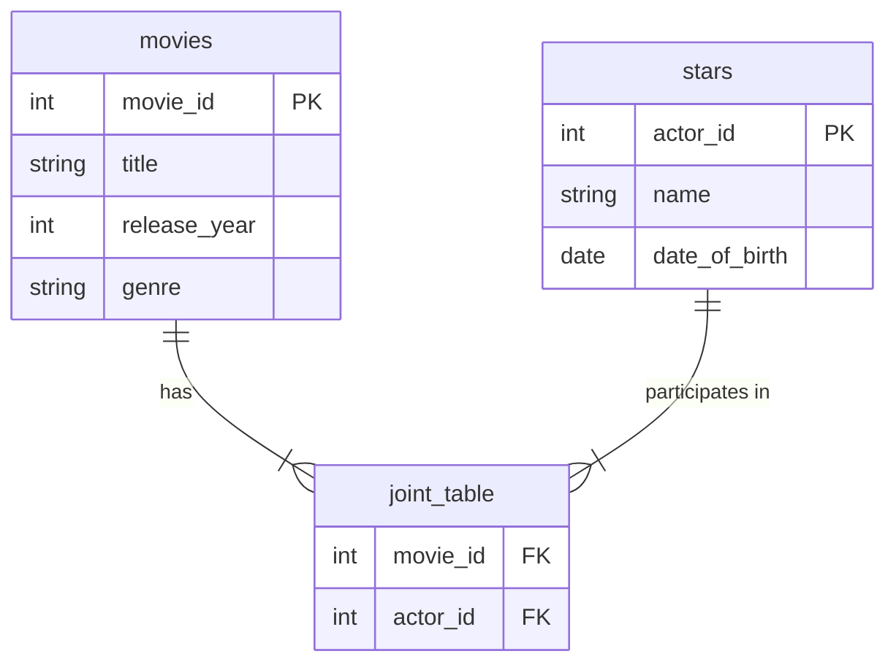

## Objectives:
- Working with Aggregate Functions and Subqueries
- Working with Groups, Join and Sets 
- Working with Transactions
## Aggregate Functions and Subqueries
### Introduction:
In previous lecture, we explored how to query data and filter rows based on specific conditions. However, what if we want to perform more advanced operations, such as calculating column values, finding averages, or summarizing data? To achieve this, SQL provides a set of powerful tools known as **Aggregate Functions**.
### Aggregate Functions:
Aggregate functions enhance the `SELECT` statement by enabling calculations and summarization of data. These functions allow us to perform operations like finding maximum or minimum values, calculating sums, counting rows, and computing averages. Below are some of the most commonly used aggregate functions:
#### MAX:
This function is used to retrieve the **maximum value** from a specified column. It evaluates all rows that match the given condition or, if no condition is provided, it returns the maximum value from **all rows** in the table.
**Syntax:**
```
SELECT MAX(column_name) FROM table_name WHERE condition
```
#### MIN:
This function is used to retrieve the **minimum value** from a specified column. It evaluates all rows that match the given condition or, if no condition is provided, it returns the minimum value from **all rows** in the table.  
**Syntax:**  
```
SELECT MIN(column_name) FROM table_name WHERE condition
```
#### SUM:
This function is used to calculate the **total sum** of values in a specified column. It adds up all values from rows that match the given condition or, if no condition is provided, it sums all values in the column.  
**Syntax:**  
```
SELECT SUM(column_name) FROM table_name WHERE condition
```
#### COUNT:
This function is used to **count the number of rows** that match a specified condition. If no condition is provided, it counts all rows in the table.  
**Syntax:**  
```
SELECT COUNT(column_name) FROM table_name WHERE condition
```

#### AVG:
This function is used to calculate the **average value** of a numeric column. It computes the average for rows that match the given condition or, if no condition is provided, it calculates the average for all rows.  
**Syntax:**  
```
SELECT AVG(column_name) FROM table_name WHERE condition
```
#### ROUND:
This function is used to **round a numeric value** to a specified number of decimal places. It is often used in conjunction with other aggregate functions like `AVG()` to format results.  
**Syntax:**  
```
SELECT ROUND(column_name, decimal_places) FROM table_name WHERE condition
```
#### DISTINCT:
This keyword is used to **eliminate duplicate values** from the result set, ensuring that only unique values are returned.  
**Syntax:**
```
SELECT DISTINCT column_name FROM table_name WHERE condition
```
#### Remark:
We can **combine these functions** and nest them within one another to perform more advanced calculations. For example, we can combine `DISTINCT` and `COUNT` to count the number of **unique names** in the `student` table.  
```
SELECT COUNT(DISTINCT name) FROM student;
```
### Subqueries:
In databases, tables are often related to one another. Let’s consider an example database with three tables: `movies`, `stars`, and a **joint table** that establishes a relationship between them. Suppose we want to retrieve the names of all actors who were part of a specific movie. To achieve this, we would need to:
1. Retrieve the `movie_id` from the `movies` table.
2. Use the `movie_id` to fetch the corresponding `actor_id` from the joint table.
3. Use the `actor_id` to get the actors' names from the `stars` table.

This process involves multiple steps and can be represented as a combination of three separate queries. However, SQL provides a powerful feature called **subqueries** to simplify this process. A subquery allows us to nest one query inside another, enabling us to perform complex operations in a single statement.   
To write this query using subqueries, we would first need a query to retrieve the `movie_id` from the `movies` table. Then, we would use this `movie_id` in a subquery to fetch the `actor_id` from the joint table. Finally, we would use the `actor_id` in another subquery to retrieve the actors' names from the `stars` table.  
```
SELECT name 
FROM stars 
WHERE actor_id IN (
    SELECT actor_id 
    FROM joint_table 
    WHERE movie_id = (
        SELECT movie_id 
        FROM movies 
        WHERE title = 'Movie Title'
    )
);
```  
**Explanation:**
1. The innermost query retrieves the `movie_id` for the movie with the title `'Movie Title'`.
2. The middle query uses the `movie_id` to fetch all `actor_id` values associated with that movie from the `joint_table`.
3. The outermost query retrieves the names of the actors from the `stars` table using the `actor_id` values obtained in the previous step.
## Groups, Join and Sets:
### Groups:
We used aggregation functions like `SUM` and `AVG` to perform calculations on column data. However, we noticed that these functions operate on all rows in the table and return a single result. But what if we want to calculate the sum or average for specific subsets of rows, such as those belonging to individual students?  
To achieve this, we can use the `GROUP BY` clause. The `GROUP BY` clause allows us to group rows that share a common value in a specified column, and then apply aggregation functions to each group separately.
#### Example:
Suppose we have a `marks` table that stores the marks of students. If we want to calculate the average mark for each student, we can use the `AVG` function along with `GROUP BY` on the `student_id` column. This will group the rows by each student and calculate the average mark for each student individually.
```
SELECT student_id, AVG(mark) AS average_mark
FROM marks
GROUP BY student_id;
```
#### Filter:
When using `GROUP BY`, if we want to filter the grouped results based on a specific condition, we use the `HAVING` clause instead of `WHERE`. The `HAVING` clause is specifically designed to filter results after aggregation, whereas `WHERE` filters rows before aggregation.  
**Example:**  
Continuing with the previous example, suppose we want to calculate the average mark for each student but only include students whose average mark is greater than 5. We can achieve this by adding a `HAVING` clause to our query.
```
SELECT student_id, AVG(mark) AS average_mark
FROM marks
GROUP BY student_id
HAVING AVG(mark) > 5;
```
#### Remark:
In SQL, we can use the `AS` keyword to create an **alias** for a column or expression in the `SELECT` statement. Aliases are temporary names assigned to columns or calculations in the query result, making the output more readable or easier to reference.
### Join:
SQL gives us the power to **join tables** together and combine their data into a single result set. There are **four main types of joins** in SQL:
1. **INNER JOIN**
2. **LEFT JOIN** (or LEFT OUTER JOIN)
3. **RIGHT JOIN** (or RIGHT OUTER JOIN)
4. **FULL JOIN** (or FULL OUTER JOIN)
5. **CROSS JOIN**
To join tables in SQL, we write a `SELECT` statement, specify the first table, and then use the **join command** (e.g., `INNER JOIN`, `LEFT JOIN`, etc.) followed by the second table name. After that, we use the `ON` keyword to specify the column(s) used to match rows between the tables. SQL will then combine rows from the first table (`Table A`) with rows from the second table (`Table B`) where the values in the specified columns match.
#### INNER JOIN:
An **INNER JOIN** in SQL is used to combine rows from two or more tables based on a related column between them. It returns only the rows where there is a **match** in both tables. If a row in one table does not have a corresponding match in the other table, it will **not** be included in the result.  
**Example:**
student table:

| student_id | name    |
| ---------- | ------- |
| 1          | Alice   |
| 2          | Bob     |
| 3          | Charlie |

mark table:

| student_id | mark |
| ---------- | ---- |
| 1          | 85   |
| 2          | 70   |
| 4          | 90   |

After **INNER JOIN** we will get the following table:

| student_id | name  | mark |
| ---------- | ----- | ---- |
| 1          | Alice | 85   |
| 2          | Bob   | 70   |
the Sql command:
```
SELECT students.student_id, students.name, marks.mark
FROM students
INNER JOIN marks ON students.student_id = marks.student_id;
```
#### LEFT JOIN:
A **LEFT JOIN** returns all rows from the **left table** and the matching rows from the **right table**. If there is no match in the right table, `NULL` values are returned for columns from the right table.  
**Example:**
student table:

| student_id | name    |
| ---------- | ------- |
| 1          | Alice   |
| 2          | Bob     |
| 3          | Charlie |

mark table:

| student_id | mark |
| ---------- | ---- |
| 1          | 85   |
| 2          | 70   |
| 4          | 90   |

After **LEFT JOIN** we will get the following table:

| student_id | name    | mark |
| ---------- | ------- | ---- |
| 1          | Alice   | 85   |
| 2          | Bob     | 70   |
| 3          | Charlie | Null |
the Sql command:
```
SELECT students.student_id, students.name, marks.mark
FROM students
LEFT JOIN marks ON students.student_id = marks.student_id;
```
#### RIGHT JOIN:
A **RIGHT JOIN** returns all rows from the **right table** and the matching rows from the **left table**. If there is no match in the left table, `NULL` values are returned for columns from the left table.  
**Example:**
student table:

| student_id | name    |
| ---------- | ------- |
| 1          | Alice   |
| 2          | Bob     |
| 3          | Charlie |

mark table:

| student_id | mark |
| ---------- | ---- |
| 1          | 85   |
| 2          | 70   |
| 4          | 90   |

After **RIGHT JOIN** we will get the following table:


| student_id | name  | mark |
| ---------- | ----- | ---- |
| 1          | Alice | 85   |
| 2          | Bob   | 70   |
| NULL       | NULL  | 90   |
the Sql command:
```
SELECT students.student_id, students.name, marks.mark
FROM students
RIGHT JOIN marks ON students.student_id = marks.student_id;
```
#### FULL JOIN (OUTER JOIN):
A **FULL JOIN** returns all rows when there is a match in **either the left or right table**. If there is no match, `NULL` values are returned for columns from the table without a match.  
**Example:**
student table:

| student_id | name    |
| ---------- | ------- |
| 1          | Alice   |
| 2          | Bob     |
| 3          | Charlie |

mark table:

| student_id | mark |
| ---------- | ---- |
| 1          | 85   |
| 2          | 70   |
| 4          | 90   |

After **FULL JOIN** we will get the following table:

| student_id | name    | mark |
| ---------- | ------- | ---- |
| 1          | Alice   | 85   |
| 2          | Bob     | 70   |
| 3          | Charlie | NULL |
| NULL       | NULL    | 90   |
the Sql command:
```
SELECT students.student_id, students.name, marks.mark
FROM students
FULL JOIN marks ON students.student_id = marks.student_id;
```
#### CROSS JOIN:
A **CROSS JOIN** returns the **Cartesian product** of the two tables, meaning it combines every row from the first table with every row from the second table. No `ON` condition is used.  
**Example:**
student table:

| student_id | name    |
| ---------- | ------- |
| 1          | Alice   |
| 2          | Bob     |
| 3          | Charlie |

mark table:

| student_id | mark |
| ---------- | ---- |
| 1          | 85   |
| 2          | 70   |
| 4          | 90   |

After **FULL JOIN** we will get the following table:

| student_id | name    | mark |
| ---------- | ------- | ---- |
| 1          | Alice   | 85   |
| 1          | Bob     | 70   |
| 1          | Charlie | 90   |
| 2          | Alice   | 85   |
| 2          | Bob     | 70   |
| 2          | Charlie | 90   |
| 3          | Alice   | 85   |
| 3          | Bob     | 70   |
| 3          | Charlie | 90   |

the Sql command:
```
SELECT students.student_id, students.name, marks.mark
FROM students
CROSS JOIN marks;
```
#### Remark:
When using **GROUP BY** or **JOIN**, if columns in different tables share the same name, we need to specify which table's column we want to select. To do this, we use the **table name followed by a dot (.) and the column name** (e.g., `table_name.column_name`). This avoids ambiguity and ensures the correct column is referenced.  
Additionally, we can join **more than two tables** together in SQL. Using the `JOIN` clause, we can combine **3, 4, or even more tables** in a single query. Each join operation connects two tables at a time, and we can chain multiple joins to include as many tables as needed.
### Sets:
Sets are fundamental mathematical constructs that allow us to group and manipulate collections of elements. In the context of data, sets provide a powerful way to organize, compare, and analyze information. By treating data as sets, we can perform a variety of **set operations** to derive meaningful insights and relationships. These operations include unions, intersections, differences, and more, which help us combine, compare, and filter data effectively.  
SQL allows us to treat query results as sets and perform set operations on them, making it an invaluable tool for data analysis and manipulation.
#### Set Operations in SQL:
**UNION**: Combines the results of two or more SELECT queries into a single result set, removing duplicates.
```
SELECT column_name FROM table1
UNION
SELECT column_name FROM table2;
```
**UNION ALL**: Similar to UNION, but includes duplicates.
```
SELECT column_name FROM table1
UNION ALL
SELECT column_name FROM table2;
```
**INTERSECT**: Returns only the common rows between two SELECT queries.
```
SELECT column_name FROM table1
INTERSECT
SELECT column_name FROM table2;
```
**EXCEPT (or MINUS in some databases)**: Returns rows from the first SELECT query that are not present in the second SELECT query.
```
SELECT column_name FROM table1
EXCEPT
SELECT column_name FROM table2;
```
## Transactions:

### Introduction:
Imagine we have created a database for a bank management system. One of the tables in this database stores the balance of users' accounts. Before a user withdraws money from their account, the system checks if the account has enough balance. If the balance is sufficient, the withdrawal is processed; otherwise, the transaction is stopped.  
However, what if a user tries to exploit the system by attempting to withdraw the same amount from two different banks simultaneously? For example, the first bank checks the balance, finds it sufficient, and proceeds to remove the money. At the same time, the second bank also checks the balance, finds it sufficient, and removes the money as well. In this scenario, the user could end up withdrawing double the amount they actually have, leading to a critical inconsistency in the system.  
To prevent such issues, we can use **transactions**. Transactions ensure that a sequence of operations is treated as a single, indivisible unit of work. This means that either all the operations within the transaction are successfully completed, or none of them are. By using transactions, we can maintain the integrity and consistency of the data, even in complex scenarios involving multiple operations or concurrent access.
### Creating Transactions:
In the context of our bank management system, transactions can be used to ensure that the balance check and the withdrawal operation are executed as a single unit. Here’s how it works:
1. **Begin Transaction**: Start a transaction before checking the balance.
2. **Check Balance**: Verify if the account has enough funds.
3. **Withdraw Funds**: If the balance is sufficient, proceed to withdraw the funds.
4. **Commit Transaction**: If both operations are successful, commit the transaction to save the changes.
5. **Rollback Transaction**: If any operation fails (e.g., insufficient balance), roll back the transaction to undo any changes.
#### Example:
**Without Transactions:**
```
-- Bank 1
SELECT balance FROM accounts WHERE account_id = 1; -- Check balance
-- Assume balance is 100
UPDATE accounts SET balance = balance - 50 WHERE account_id = 1; -- Withdraw 50

-- Bank 2 (executed simultaneously)
SELECT balance FROM accounts WHERE account_id = 1; -- Check balance (still sees 100)
UPDATE accounts SET balance = balance - 50 WHERE account_id = 1; -- Withdraw 50
```
In this scenario, the user ends up withdrawing a total of 100, even though they only had 50 in their account.  
**With Transactions:**
```
-- Bank 1
BEGIN TRANSACTION;
SELECT balance FROM accounts WHERE account_id = 1; -- Check balance
-- Assume balance is 100
UPDATE accounts SET balance = balance - 50 WHERE account_id = 1; -- Withdraw 50
COMMIT;

-- Bank 2 (executed simultaneously)
BEGIN TRANSACTION;
SELECT balance FROM accounts WHERE account_id = 1; -- Check balance (now sees 50)
-- Insufficient balance, so the transaction is rolled back
ROLLBACK;
```
In this scenario, the user can only withdraw 50, and the second withdrawal is prevented, ensuring the integrity of the data.
### SQL Transactions:
To create a transaction in SQL, we follow a structured process to ensure that a sequence of operations is executed as a single, atomic unit. Here’s how it works:
1. **Begin the Transaction**: We start by declaring the beginning of the transaction using the `BEGIN TRANSACTION` statement. This marks the start of our logical unit of work.
2. **Execute Operations**: After starting the transaction, we include the operations (e.g., `INSERT`, `UPDATE`, `DELETE`, or `SELECT`) that we want to execute as part of the transaction. These operations are treated as a single block.
3. **End the Transaction**: Once all the operations are successfully executed, we conclude the transaction with the `COMMIT` statement. This saves all the changes made during the transaction to the database, making them permanent.  
If any error occurs during the execution of the operations, we can use the `ROLLBACK` statement to undo all the changes made since the transaction began, ensuring that the database remains in a consistent state.
```
-- Step 1: Begin the transaction
BEGIN TRANSACTION;

-- Step 2: Execute operations
UPDATE accounts SET balance = balance - 100 WHERE account_id = 1; -- Deduct 100 from account 1
UPDATE accounts SET balance = balance + 100 WHERE account_id = 2; -- Add 100 to account 2

-- Step 3: Commit the transaction
COMMIT;
```
### Checking Errors and Rollback:
To ensure that transactions are handled safely and errors are managed effectively, we can use **IF-ELSE statements** to check for errors during the execution of a transaction. If an error occurs, we can roll back the transaction to undo any changes. If no errors occur, we can commit the transaction to save the changes permanently.
```
BEGIN TRANSACTION;

-- Step 2: Execute operations
UPDATE accounts SET balance = balance - 100 WHERE account_id = 1; -- Deduct 100 from account 1
UPDATE accounts SET balance = balance + 100 WHERE account_id = 2; -- Add 100 to account 2

-- Step 3: Check for errors
IF @@ERROR > 0 -- Check if any error occurred
BEGIN
    -- Step 4: Rollback the transaction if there is an error
    ROLLBACK;
END
ELSE
BEGIN
    -- Step 5: Commit the transaction if there are no errors
    COMMIT;
END;
```
### Nested Transactions:
**Nested Transactions** allow you to create transactions within other transactions. This can be useful for organizing complex operations into smaller, manageable units.
```
BEGIN TRANSACTION;

-- Outer transaction
BEGIN TRANSACTION;

-- Inner transaction
UPDATE accounts SET balance = balance - 50 WHERE account_id = 1;

-- Commit the inner transaction
COMMIT;

-- Commit the outer transaction
COMMIT;
```
#### How it will work:
1. **Outer Transaction**: The main transaction that encapsulates all operations.
2. **Inner Transaction**: A transaction that is started within the outer transaction.
3. **Commit and Rollback**:
    - Committing an inner transaction does not save changes permanently; it only marks the inner transaction as complete.
    - Only the outermost transaction’s `COMMIT` statement saves changes permanently to the database.
    - If the outer transaction is rolled back, all changes made within the inner transactions are also undone, even if the inner transactions were committed.
### SQLite Nested Transactions:
n SQLite, **nested transactions** are not natively supported in the same way as in some other databases (e.g., MySQL or PostgreSQL). However, you can simulate nested transactions using **savepoints**. Savepoints allow you to create checkpoints within a transaction, which you can roll back to without affecting the entire transaction.
```
BEGIN TRANSACTION;

-- Create a savepoint for the "inner transaction"
SAVEPOINT inner_transaction;

-- Perform the update operation
UPDATE accounts SET balance = balance - 50 WHERE account_id = 1;

-- Check if the update was successful
-- If no rows were updated, rollback to the savepoint
CASE
    WHEN changes() = 0 THEN
        ROLLBACK TO inner_transaction;
    ELSE
        RELEASE inner_transaction; -- Release the savepoint if successful
END;

-- Commit the outer transaction
COMMIT;

```
## Tasks:
### Task 1:
You are working with a **Sales Database** that includes the following tables:
1. **Products**: Columns: `product_id`, `product_name`, `category`, `price`.
2. **Orders**: Columns: `order_id`, `product_id`, `quantity`, `order_date`.
**Using Aggregate Functions:**
- Write queries to:
    - Calculate the total revenue generated from each product category.
    - Determine the average price of products within the "Electronics" category.
    - Identify the product with the highest total sales quantity.
**Using Subqueries:**
- Write queries to:
    - Retrieve all products that have not been included in any orders.
    - Find the product categories where the average price is higher than the overall average price of all products.
**Using Grouping:**
- Write queries to:
    - Group orders by month and calculate the total sales for each month.
    - Filter the grouped results to display only those months where the total sales exceed $10,000.
### Task 2:
You manage a **Library Database** with these tables:
1. **Books**:
    - Columns: `book_id`, `title`, `author`, `genre`.
2. **Members**:
    - Columns: `member_id`, `name`, `email`.
3. **Loans**:
    - Columns: `loan_id`, `book_id`, `member_id`, `loan_date`, `return_date`.
 **Using Joins**:
- Perform an `INNER JOIN` to list all books currently on loan with member details.    
- Use a `LEFT JOIN` to show all members and their loaned books (include members with no loans).
**Using Set Operations**:
- Use `UNION` to combine a list of all book titles and member names.    
- Find books in the "Fiction" genre that have never been loaned using `EXCEPT`.
**Using Transactions**:
- Simulate a book return process:  
    1. Begin a transaction.
    2. Update the `return_date` for a specific loan.
    3. Check for errors; rollback if the book was never loaned.        
    4. Commit the transaction if successful.        
- Use nested transactions to handle bulk book returns and ensure atomicity.
